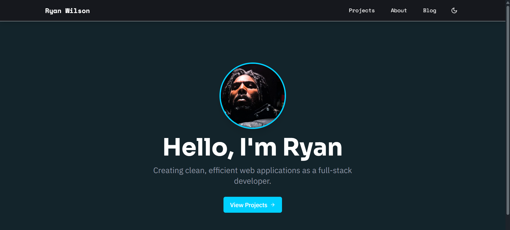

# Ryan Wilson – Portfolio Website

A modern portfolio built with **Next.js 15**, **TypeScript**, and **Tailwind CSS**. The site highlights personal projects, skills and contact details with smooth animations and a clean design.

## ✨ Live Demo

[ryan-2025.vercel.app](https://ryan-2025.vercel.app)

### Lighthouse scores (automated)


## 🛠️ Tech Stack

- **Framework**: [Next.js 15](https://nextjs.org/) (App Router)
- **Language**: TypeScript
- **Styling**: [Tailwind CSS](https://tailwindcss.com/) and [DaisyUI](https://daisyui.com/)
- **Animations**: [Framer Motion](https://www.framer.com/motion/)
- **Icons**: [Lucide React](https://lucide.dev/)
- **Fonts**: [Roboto](https://fonts.google.com/specimen/Roboto) and [Inter](https://fonts.google.com/specimen/Inter)
- **Theme Management**: [next-themes](https://github.com/pacocoursey/next-themes)
- **Markdown**: react-markdown & remark-gfm
- **Testing**: Jest and @testing-library/react

## 📁 Project Structure

```text
src/
├── app/            # App Router pages and layouts
├── components/     # Reusable React components
├── hooks/          # Custom hooks
├── data/           # Static project and content data
├── utils/          # Helper utilities
public/             # Static assets (images, icons)
```

## 🔍 Features

- Responsive layout with light and dark themes
- Animated page transitions and interactive elements
- Filterable project gallery with dynamic detail pages
- Contact form powered by Formspree
- Typed React components and strict TypeScript configuration

## 🚀 Getting Started

Install dependencies and start the development server:

```bash
npm install
npm run dev
```

Run linting, build, and tests:

```bash
npm run lint
npm run build
npm test
```

## 📸 Screenshot



## 📬 Contact

Feel free to reach out via [LinkedIn](https://www.linkedin.com/in/ryan-e-wilson/) or visit my [GitHub profile](https://github.com/RW2023).

## 📄 License

This project is licensed under the MIT License.

---
Created with ❤️ by Ryan Wilson
